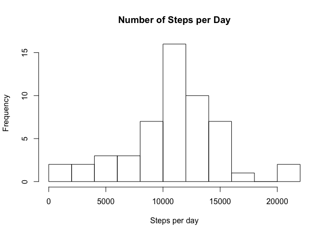
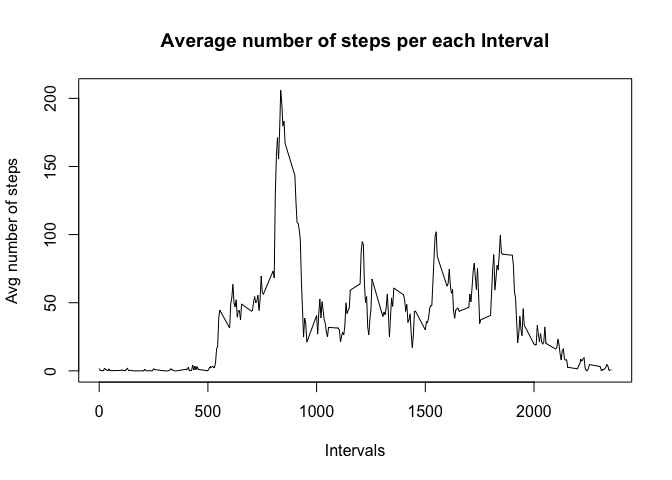
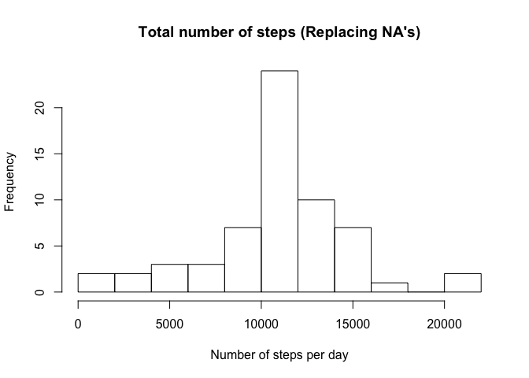
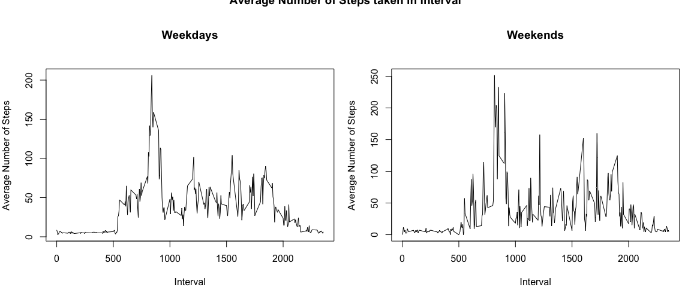

## Introduction

This assignment makes use of data from a personal activity monitoring device. This device collects data at 5 minute intervals through out the day. The data consists of two months of data from an anonymous individual collected during the months of October and November, 2012 and include the number of steps taken in 5 minute intervals each day.

The variables included in the analysed dataset are:

- **steps**: Number of steps taking in a 5-minute interval (missing values are coded as NA)
- **date**: The date on which the measurement was taken in YYYY-MM-DD format
- **interval**: Identifier for the 5-minute interval in which measurement was taken


The dataset is stored in a comma-separated-value (CSV) file and there are a total of 17,568 observations in this dataset.


## Loading and preprocessing data

##### 1. Load the data (i.e. read.csv())
Data loaded from working directory into variable 'activity_data':


```r
activity_data <- read.csv("activity.csv")
```

## What is the mean total number of steps taken per day?


##### 1. Total number of steps taken per day
The number of steps taken for each day is the total sum of steps divided by number of days.


```r
 sum(activity_data$steps, na.rm = TRUE)/length(unique(activity_data$date))
```

```
## [1] 9354.23
```

##### 2. Make a histogram of the total number of steps taken each day


```r
by_date <- group_by(activity_data, date)
StepsPerDay <- summarise(by_date, sum(steps))

hist(StepsPerDay$`sum(steps)`,
     breaks = 10,
     main = "Number of Steps per Day",
     xlab = "Steps per day",
     ylab = "Frequency")
```

<!-- -->

##### 3. Mean and median of number of steps by day


```r
mean(StepsPerDay$`sum(steps)`, na.rm= TRUE)
```

```
## [1] 10766.19
```


```r
median(StepsPerDay$`sum(steps)`, na.rm = TRUE)
```

```
## [1] 10765
```


## What is the average daily activity pattern?
To determine the average daily activity pattern, the dataset contains information about the intervals.


```r
stepsPerInterval <- group_by(activity_data, interval)
average_stepsPerInterval <- summarise(stepsPerInterval, mean(steps, na.rm = TRUE))
```

##### 1. Make a time series plot


```r
plot(average_stepsPerInterval, type="l", main="Average number of steps per each Interval",
     xlab="Intervals",
     ylab="Avg number of steps")
```

<!-- -->

##### 2. Which 5 minute interval, on average across all the days in the dataset, contains the maximum number of steps?


```r
maximum_interval_i <- which(average_stepsPerInterval[,2] == max(average_stepsPerInterval[,2]))
maximum_interval <- average_stepsPerInterval[maximum_interval_i, 1]
as.numeric(maximum_interval)
```

```
## [1] 835
```

* Most Steps at interval: 835


## Imputing missing values

##### 1. Calculate and report the total number of missing values in the dataset 

```r
sum(is.na(activity_data$steps))
```

```
## [1] 2304
```


##### 2. Strategy for filling in all of the missing values in the dataset

For a given day, it is either NA or not. It cannot contain intervals with NA and some without for the same day.

Therefore, replacing it with **average values** can be done.


```r
num_naPerDay <- summarise(by_date, sum(is.na(activity_data$steps)))
unique(num_naPerDay[,2])
```

```
## # A tibble: 1 x 1
##   `sum(is.na(activity_data$steps))`
##                               <int>
## 1                              2304
```

```r
sum(is.na(StepsPerDay[,2]))
```

```
## [1] 8
```
##### 3. Create a new dataset that is equal to the original dataset but with the missing data filled in.

Replace NA by average


```r
activity_data_imputed <- activity_data
activity_data_imputed$steps <- impute(activity_data$steps, fun=mean)
```


##### 4. Make a histogram of the total number of steps taken each day 

```r
steps_perDayImputed <- group_by(activity_data_imputed, date)
stepsPerDayImputed <- summarise(steps_perDayImputed, sum(steps))

hist(stepsPerDayImputed$`sum(steps)`, breaks=10, main="Total number of steps (Replacing NA's)",
     xlab="Number of steps per day",
     ylab="Frequency")
```

<!-- -->

##### 4.1 Calculate and report the mean and median total number of steps taken per day. 


```r
mean(stepsPerDayImputed$`sum(steps)`)
```

```
## [1] 10766.19
```


```r
median(stepsPerDayImputed$`sum(steps)`)
```

```
## [1] 10766.19
```
#### 4.2 What is the impact of imputing missing data on the estimates of the total daily number of steps?

The mean stays equal to the estimate from the first part of the assignment, because adding the average does not change the average of the resulting sequence.

The median has changed, because the number of days has changed. However, the total number of steps is now equal to the average of the total number of steps taken per day.

## Are there differences in activity patterns between weekdays and weekends?

##### 1. Create a new factor variable in the dataset with two levels – “weekday” and “weekend” indicating whether a given date is a weekday or weekend day.


```r
activity_data_imputed$dateType <-  ifelse(as.POSIXlt(stepsPerDayImputed$date)$wday %in% c(0,6), 'weekend', 'weekday')
```


##### 2. Make a panel plot containing a time series plot .


```r
weekday_interval <- group_by(activity_data_imputed, interval, dateType)

average_stepsPerIntervalWeekday <- summarise(weekday_interval, mean(steps))
```


```r
par(mfrow = c(1, 2), mar = c(4, 4, 6, 1))
plot(subset(average_stepsPerIntervalWeekday, dateType == "weekday")$interval,
     subset(average_stepsPerIntervalWeekday, dateType == "weekday")$`mean(steps)`,
     type = "l",
     main = "Weekdays",
     xlab = "Interval",
     ylab = "Average Number of Steps")
plot(subset(average_stepsPerIntervalWeekday, dateType == "weekend")$interval,
     subset(average_stepsPerIntervalWeekday, dateType == "weekend")$`mean(steps)`,
     type = "l",
     main = "Weekends",
     xlab = "Interval",
     ylab = "Average Number of Steps")
title(main="Average Number of Steps taken in Interval", outer = T)
```

<!-- -->
